# Uczenie maszynowe - Dokumentacja  końcowa

**Skład zespołu:** Rafał Celiński

## **1. Streszczenie opisu projektu**

### **Problem**

#### Zaimplementować zmodyfikowaną wersję algorytmu generowania lasu losowego, w której zamiast drzew składowymi są naiwne klasyfikatory Bayesa

### **Opis algorytmów**

### Naiwny klasyfikator Bayesa

Naiwny klasyfikator Bayesa to metoda klasyfikacji, która opiera się na założeniu, że cechy są statystycznie niezależne od siebie. Dzięki temu założeniu, można użyć twierdzenia Bayesa do obliczenia prawdopodobieństwa, z jakim zbiór cech należy do danej klasy.


W praktyce, mianownik jest stały, dlatego obliczenie prawdopodobieństwa możemy uprościć do policzenia licznika. Otrzymane wyniki nie będą sumowac się do 1, ale to nie problem, gdy potrzebujemy znać tylko najbardziej prawdopodobną klasę.

Na podstawie danych treningowych wyliczamy prawdopodobieństwo wystąpienia klasy: P(C) oraz prawdopodobieństwa P(F|C) i zapisujemy je w pamięci modelu. Korzystając z powyższego wzoru, możemy przewidywać klasę nowych danych.

### Las losowy z klasyfikatorami Bayesa

Las losowy z klasyfikatorami Bayesa zamiast drzew decyzyjnych, jak jego klasyczna wersja, wykorzystuje klasyfikatory Bayesa. Trenowanych jest wiele klasyfikatorów na lekko różnych fragmentach trenującego zbioru danych. Niektóre cechy brane są wielokrotnie, inne wcale. Cechy wybierane są losowo ze zwracaniem. Tak samo wybierane są próbki z zbioru trenującego. Ilość klasyfikatorów, cech i próbek trenujacych ustalamy w parametrach lasu.

### Ocena jakości modeli klasyfikacji

#### Dokładność (Accuracy)

Procent poprawnych przewidywań dokonanych przez model względem całkowitej liczby obserwacji. Obliczany ze wzoru: 

#### Precyzja (Precision)

Obliczany ze wzoru: 

#### Recall

Współczynnik prawdziwych pozytywnych. Obliczany ze wzoru: 

#### F1-Score

Średnia harmoniczna precyzji i recall: 

## **2. Implementacja**

Zaimplementowaliśmy własny naiwny klasyfikator bayesa oraz własny las losowy. Obie klasy mają taki sam interfejs. Funkcja `fit` służy do dopasowania modelu, a funkcje `predict` i `predict_proba` przewidują klasę podanej próbki danych. `predict_proba` dodatkowo z zwraca prawdopodobieństwo wystapienia każdej klasy.

Poza tym zaimplementowaliśmy funkcje do testowania, oceny modelu i generowania wykresów, jednak nie są one kluczowe w projekcie, dlatego pomijamy je w dokumentacji. Są dostepne w kodzie źródłowym projektu.

### **Kod źródłowy**

#### Naiwny klasyfikator bayesa

Klasyfikator Bayesa zapisuje prawdopodobieństwa obliczone w trakcie trenowania.

```python
class NaiveBayes:
    def __init__(self):
        self.priors = {}
        self.likelihoods = {}
```

Funkcja `fit` oblicza prawdopodobieństwa na podstawie podanych danych. Prawdopodobieństwo 0 jest zamieniane na 10^-6, aby uniknąć problemów z dzieleniem przez zero.

```python
    def fit(self, x_train, y_train):
        self.priors = y_train.value_counts(normalize=True).replace(0, 1e-6)
        df = pd.concat([x_train, y_train], axis=1)
        
        for cls in y_train.unique():
            class_data = df[df[y_train.name] == cls].drop(columns=[y_train.name])
            feature_prob = class_data.apply(lambda col: col.value_counts(normalize=True).replace(0, 1e-6), axis=0)
            self.likelihoods[cls] = feature_prob
```

Funkcja `predict` oblicza prawdopodobieństwa wystąpienia klas dla otrzymanych danych i zwraca klasę, której prawdopodobieństwo jest najwyższe.

```python
    def predict(self, sample):
        postori = {}
        for cls, prob in self.priors.items():
            for feature in self.likelihoods[cls]:
                prob *= self.likelihoods[cls][feature].get(sample[feature], 1e-6)
            postori[cls] = prob if prob != 0 else 1e-6
        return max(postori, key=postori.get)
```

Funkcje `predict_proba` robi to samo co funkcja `predict`, dodatkowo zwraca prawdopodobieństwa wystąpienia wszystkich klas.

```python
    def predict_proba(self, sample):
        postori = {}
        for cls, prob in self.priors.items():
            for feature in self.likelihoods[cls]:
                prob *= self.likelihoods[cls][feature].get(sample[feature], 1e-6)
            postori[cls] = prob if prob != 0 else 1e-6
        
        postori_sum = sum(postori.values())
        return max(postori, key=postori.get), {key: value / postori_sum  for key, value in postori.items()}
```

#### Las losowy, wykorzystujący klasyfikatory Bayesa

W lesie losowym zapisywane są parametry (opisane w dalszej części dokumentacji) oraz kolekcja wszystkich klasyfikatorów należących do lasu.

```python
class BayesRandomForest:
    def __init__(self, n_classifiers, n_features, n_samples):
        self.classifiers = []
        self.n_classifiers = n_classifiers
        self.n_features = n_features
        self.n_samples = n_samples
```

Funkcja `fit` losuje próbkę danych ze zbioru treningowego i używa jej do zbudowania klasyfikatorów.

```python
    def fit(self, x_train, y_train):
        for _ in range(self.n_classifiers):
            df = pd.concat([x_train, y_train], axis=1)
            sample = df.sample(n=self.n_samples, replace=True)
            x_sample = sample.drop(columns=[y_train.name])
            y_sample = sample[y_train.name]
            self.classifiers.append(self.build_classifier(x_sample, y_sample, self.n_features))
```

Funkcja `predict` sprawdza predykcję wszystkich modeli i zwraca klasę wybieraną najczęściej.

```python
    def predict(self, sample):
        predictions = []
        for classifier, selected_columns in self.classifiers:
            predict_columns = sample[selected_columns]
            predictions.append(classifier.predict(predict_columns))
        
        return max(set(predictions), key=predictions.count)
```

Funkcja `predict_proba` sprawdza predykcję wszystkich modeli i zwraca klasę wybieraną najczęściej. Dodatkowo oblicza średnią wystąpienia klas i również je zwraca.

```python
    def predict_proba(self, sample):
        predictions_probability = []
        for classifier, selected_columns in self.classifiers:
            predict_columns = sample[selected_columns]
            predictions_probability.append(classifier.predict_proba(predict_columns))
        
        sums = {}
        for _, predict_proba in predictions_probability:
            for key in predict_proba.keys():
                sums[key] = sums.get(key, 0) + predict_proba[key]

        n_cls = len(predictions_probability)

        predictions = [prediction for prediction, _ in predictions_probability]
        return max(set(predictions), key=predictions.count), {key: value/n_cls for key, value in sums.items()}
```

Statyczna metoda `build_classifier` losuje zestaw cech i na ich podstawie tworzy naiwny klasyfikator Bayesa.

```python
    @staticmethod    
    def build_classifier(x_train, y_train, n_features):

        train_columns = x_train.sample(n=n_features, axis=1, replace=True)

        selected_columns = train_columns.columns.tolist()

        bayes = NaiveBayes()
        bayes.fit(train_columns, y_train)

        return (bayes, selected_columns)
```

#### Funkcja obliczająca jakość klasyfikatora

Funkcja na podstawie otrzymanej listy predykcji i prawidłowych klas oblicza średnią jakość modelu. Dokładnie precyzję, dokładność, ocene recall i f1 score.

```python
def analyse_test(results:list):
    n_correct = np.sum([prediction[0] == prediction[1] for prediction in results])
    avg_accuracy = n_correct / len(results)

    n_class = len(results[0][2].keys())
    confusion_matrix = np.zeros((n_class, n_class))

    for prediction in results:
        confusion_matrix[prediction[0]][prediction[1]] += 1

    precisions = []
    recalls = []
    for cls in range(n_class):
        precision = (confusion_matrix[cls][cls]/np.sum(confusion_matrix, axis=1)[cls]) if np.sum(confusion_matrix, axis=1)[cls] != 0 else 0
        recall = (confusion_matrix[cls][cls]/np.sum(confusion_matrix, axis=0)[cls]) if np.sum(confusion_matrix, axis=0)[cls] != 0 else 0
        precisions.append(precision) 
        recalls.append(recall)

    avg_precision = np.average(precisions)
    avg_recall = np.average(recalls)
    f1_score = 2* (avg_precision * avg_recall) / (avg_precision + avg_recall)
    
    return avg_accuracy, avg_precision, avg_recall, f1_score

```

### **Parametry lasu losowego**

`n_bins` - liczba kategorii, na które dyskretyzowane są dane w zbiorze. Klasyfikator Bayesa wymaga dyskretnych danych, a zbiory danych są liniowe  
`n_classifiers` - liczba klasyfikatorów Bayesa w lesie losowym  
`n_features` - Liczba cech wykorzystywanych do budowy jednego klasyfikatora. Cechy są losowane ze zwracaniem, a parametr definiuje ile cech jest losowanych
`n_samples` - Liczba danych treningowych do budowy jednego klasyfikatora. Jak wyżej, tylko przykłady treningowe.  

W dalszej części dokumentacji pojawiają się również parametry `p_features` i `p_samples`. Są to współczynniki wykorzystywane do obliczania parametrów `n_features` i `n_samples` na podstawie ich ilości w zbiorze danych. Wykorzystaliśmy to dla uproszczenia pracy. `n_features = p_features * liczba cech w zbiorze`

## **3. Zbiory danych**

Algorytm testowaliśmy na 3 zbiorach danych:

### [**Breast Cancer Wisconsin**](https://www.kaggle.com/datasets/uciml/breast-cancer-wisconsin-data)

Zbiór zawierający informacje o łagodnych i złośliwych nowotworach piersi. Zawiera 30 cech oraz predykcję o typie nowotworu. Składa sie z 569 rekordów.

### [**Diabetes Dataset**](https://www.kaggle.com/datasets/mathchi/diabetes-data-set)

Zbiór zaweirający informację o diagnozie cukrzycy. Zawiera 8 cech. Składa się z 768 rekordów.

### [**Iris Species**](https://www.kaggle.com/datasets/uciml/iris)

Podstawowy zbiór o gatunkach Irysa i ich wymiarach. Zawiera 4 cechy. Składa się z 150 rekordów.

## **4. Testy algorytmów**

### **Testy wstępne**

Na początku przetestowaliśmy ogólne testy parametrów lasu losowego z klasyfikatorami Bayesa.

```python
    n_bins = [4, 8, 12]
    n_classifiers = [50, 75, 100, 200]
    p_features = [0.5, 1.0, 2.0] 
    p_samples = [0.5, 1.0, 2.0]
```

Testowaliśmy każdą kombinację podanych wyżej parametrów.

#### Diabetes dataset

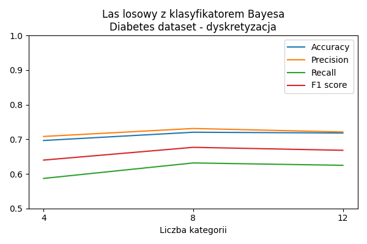

Trzy testowane warianty mają podobną ocenę. Jednak widać lekką górkę na wartości 8, dlatego ją wybieramy.


Wskaźniki jakości modelu są stałe mimo zmiany liczby klasyfikatorów, jednak postanowiliśmy przyjąć 100 jako odpowiednią wartość aby otrzymać dobrą jakość przy optymalizacji czasu potrzebnego na dopasowywanie modelu.

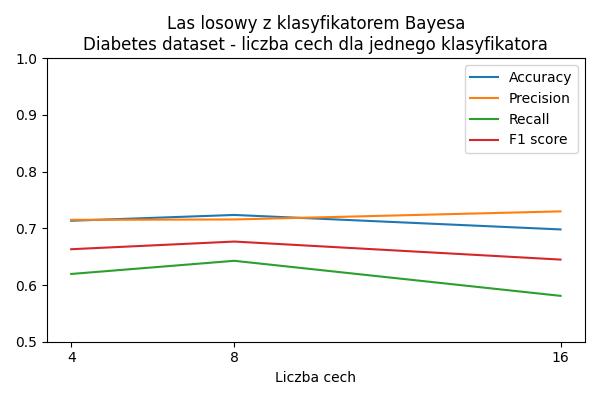  


Z danych wynika, że najlepszą skuteczność ma losowanie 8 cech i używanie 768 próbek, czyli dokładnie tyle ile jest w zbiorze.

Domyślny zestaw parametrów który wybraliśmy dla zbioru **Diabetes dataset** to:

```python
    n_bins = 8
    n_classifiers = 100
    p_features = 1.0
    p_samples = 1.0
```

#### Iris Species

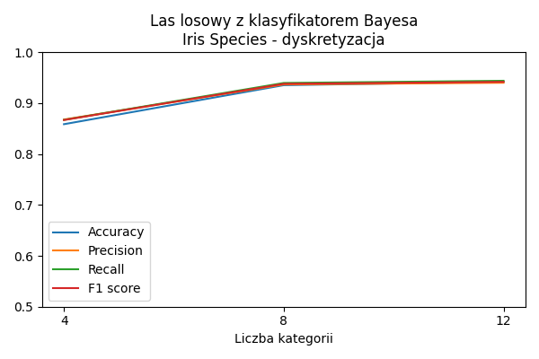  
  
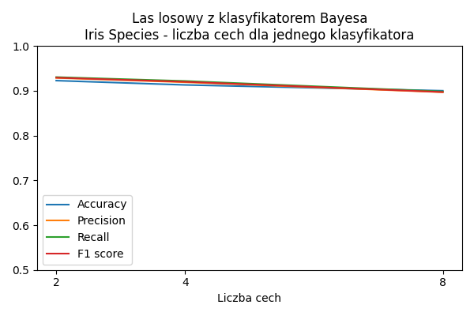  


Dla zbioru Iris wybraliśmy parametry:

```python
    n_bins = 8
    n_classifiers = 100
    p_features = 1.0
    p_samples = 1.0
```

#### Breast Cancer Wisconsin

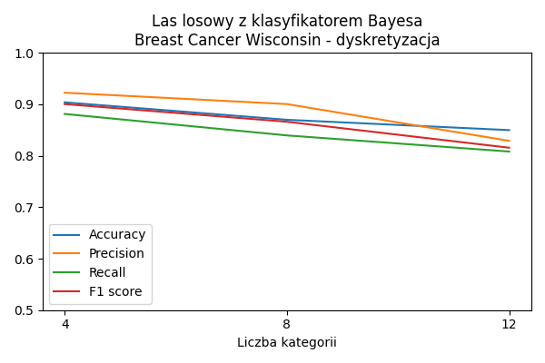  
  
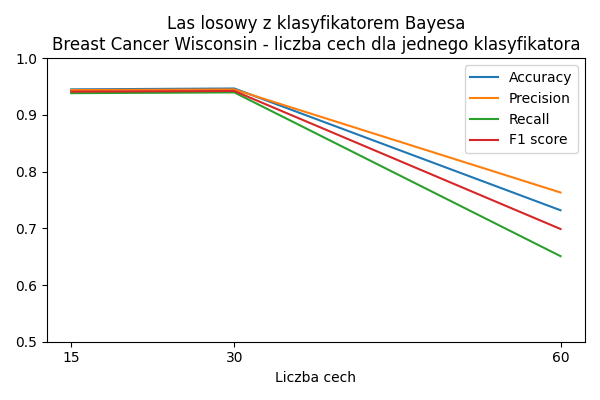  


Dla zbioru Breast Cancer Wisconsin wybraliśmy:

```python
    n_bins = 8
    n_classifiers = 100
    p_features = 1.0
    p_samples = 1.0
```

### Dokładne testy parametrów

Mając już wstępnie wybrane parametry, rozpoczęliśmy szczegółowe testy, z mniejszymi przedziałami parametrów.

#### Diabetes dataset

##### Liczba kategorii na które dyskretyzowane są cechy

```python
    n_bins = [4, 8, 12, 16]
```

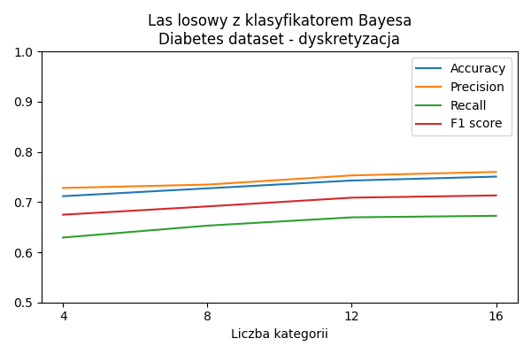

Skuteczność lasu losowego z klasyfikatorami Bayesa lekko rośnie wraz ze wzrostem liczby kategorii na które dzielone są dane.

##### Liczba klasyfikatorów w lesie losowym

```python
    n_classifiers = [100, 125, 150, 200, 225, 250, 275, 300]
```


Skuteczność modelu jest stała niezaleznie od ilości użytych klasyfikatorów. Postanowiliśmy wykonać kolejny test na mniejszej ilości klasyfikatorów. Na wykresie widać, że skuteczność stabilizuje sie już przy użyciu 5 klasyfikatorów.

```python
    n_classifiers = [2, 3, 5, 10, 15, 20, 30, 50, 100]
```


##### Współczynnik ilości cech

```python
    p_features = [0.5, 0.75, 1.0, 1.25, 1.5, 1.75, 2.0]
```

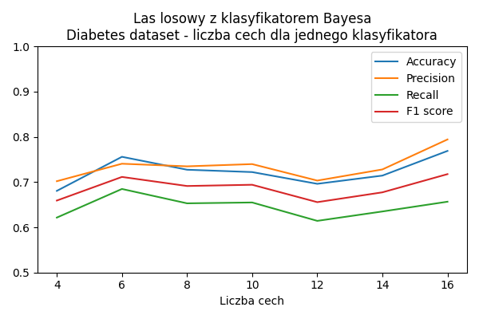

Wielokrotne wybieranie tych samych cech nie wpływa znacząco na jakość predykcji.

##### Współczynnik ilości próbek do trenowania

```python
    p_samples = [0.5, 0.75, 1.0, 1.25, 1.5, 1.75, 2.0]
```


Tak samo jest w przypadku ilości próbek, skuteczność jest taka sama

Na podstawie testów okazało się, że skuteczność lasu losowego z klasyfikatorem bayesa dla zbioru **Diabetes dataset** nie zalezy od parametrów algorytmu. Precyzja algorytmu zawsze mieści się w przedziale 70 - 75%.

#### Iris Species

##### Liczba kategorii na które dyskretyzowane są cechy

```python
    n_bins = [4, 8, 12, 16]
```

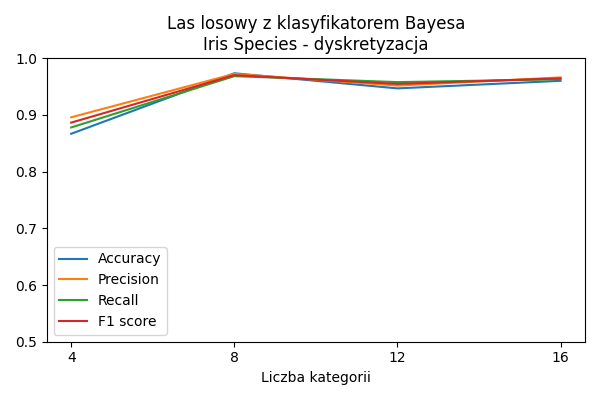

Przy dyskretyzacji danych na 8 kategorii, algorytm uzyskuje dokładność i precyzję ponad 90%.

##### Liczba klasyfikatorów w lesie losowym

```python
    n_classifiers = [100, 125, 150, 200, 225, 250, 275, 300]
```


Na wykresie widać lekki spadek jakości wraz ze wzrostem liczby klasyfikatorów, jednak dalej jest bardzo wysoki.

##### Współczynnik ilości cech

```python
    p_features = [0.5, 0.75, 1.0, 1.25, 1.5, 1.75, 2.0]
```

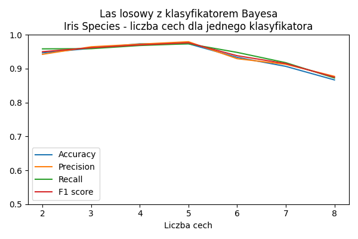

Większa ilość cech na jeden klasyfikator Bayesa, zmniejsza jakość modelu.

##### Współczynnik ilości próbek do trenowania

```python
    p_samples = [0.5, 0.75, 1.0, 1.25, 1.5, 1.75, 2.0]
```


Liczba próbek nie wpływa na jakość.

#### Wnioski

Dla zbioru **Iris Species** parametry również nie wpływają na jakość predykcji modelu. W testowanych przypadkach, dokładność i precyzja zawsze jest większa niż 90%.

#### Breast Cancer Wisconsin

##### Liczba kategorii na które dyskretyzowane są cechy

```python
    n_bins = [4, 8, 12, 16]
```

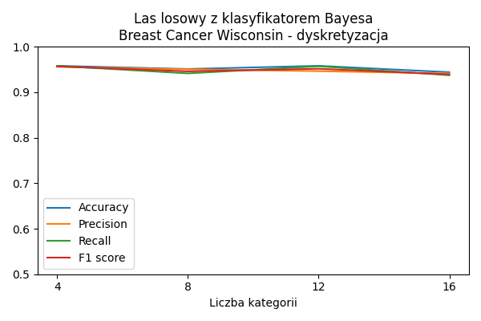

##### Liczba klasyfikatorów w lesie losowym

```python
    n_classifiers = [100, 125, 150, 200, 225, 250, 275, 300]
```


##### Współczynnik ilości cech

Tutaj postanowiliśmy sprawdzić mniejszą ilość cech, ponieważ wstępne testy pokazały wyższą jakość z mniejszą ilością cech

```python
    p_features = [0.25, 0.5, 0.75, 1.0, 1.25, 2.0]
```

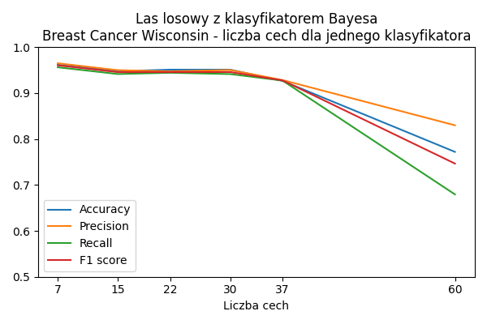

Jedynie podwojenie ilości cech wpływa na jakość modelu, dokładność predykcji spada.

##### Współczynnik ilości próbek do trenowania

```python
    p_samples = [0.5, 0.75, 1.0, 1.25, 1.5, 1.75, 2.0]
```


#### Wnioski

Podobnie jak w poprzednich zbirach, las losowy z klasyfikatorami Bayesa osiąga stałą wysokość predykcji, bez względu na wartości parametrów.

### **Test pojedynczego klasyfikatora Bayesa**

Następnie przeprowadziliśmy testy dla jednego klasyfikatora Bayesa. Jedyny parametr który mogliśmy tu sprawdzić to dyskretyzacja danych.

#### Diabetes Dataset

```python
    n_bins = [4, 8, 12, 16]
```

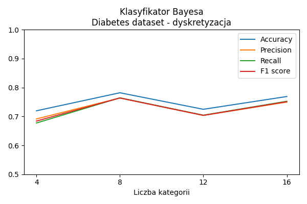

#### Iris Species

```python
    n_bins = [4, 8, 12, 16]
```


#### Breast Cancer Wisconsin

```python
    n_bins = [4, 8, 12, 16]
```

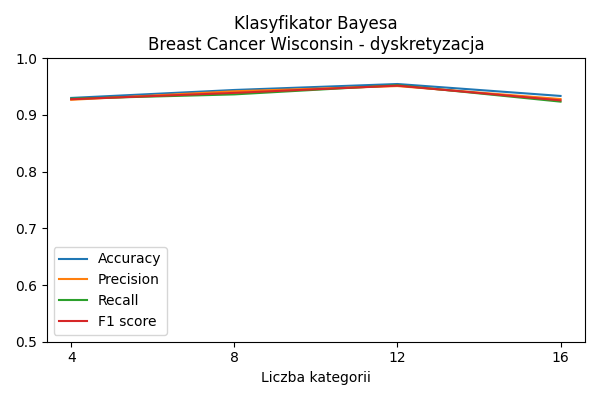

#### Wnioski

Dyskretyzacja tylko w niewielkim stopniu wpływa na dokładność predykcji naiwnym klasyfikatorem Bayesa. Zauważamy lekko lepsze wartości, jednak wykresy są względnie poziome.

### **Test klasycznego lasu losowego**

Przeprowadziliśmy też testy naszego lasu loswego, w którym umieściliśmy drzewa decyzyjne. Skorzystaliśmy z drzew decyzyjnych z pakietu `scikit-learn`.

Na każdym zbiorze danych przeprowadziliśmy te same testy parametrów lasu, aby znaleść te najlepsze. Nie dostosowywaliśmy parametrów drzew decyzyjnych, zostawiliśmy te domyślne.

#### Diabetes dataset

##### Liczba kategorii na które dyskretyzowane są cechy

```python
    n_bins = [4, 8, 12, 16]
```

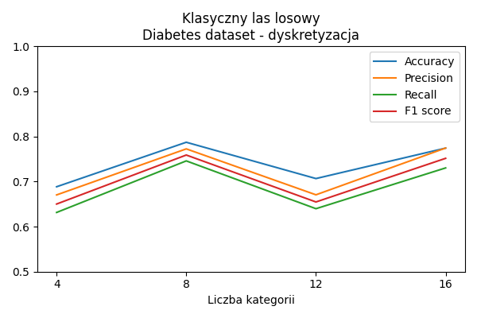

##### Liczba klasyfikatorów w lesie losowym

```python
    n_classifiers = [100, 125, 150, 200, 225, 250, 275, 300]
```


##### Współczynnik ilości cech

```python
    p_features = [0.5, 0.75, 1.0, 1.25, 1.5, 1.75, 2.0]
```

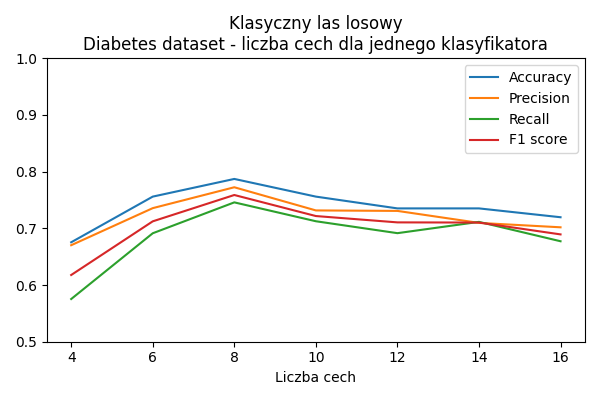

Najlepszą jakość daje losowanie ośmiu cech, czyli dokładnie tyle ile mają dane.

##### Współczynnik ilości próbek do trenowania

```python
    p_samples = [0.5, 0.75, 1.0, 1.25, 1.5, 1.75, 2.0]
```


#### Wnioski

Na podstawie testów okazało się, że najlepszy zestaw parametrów klasycznego lasu losowego dla zbioru **Diabetes dataset** to:

```python
    n_bins = 8
    n_classifiers = 125
    p_features = 1.0
    p_samples = 1.0
```

Dla których klasyfikator uzyskał wyniki ok 80% precyzji i dokładności.

#### Iris Species

##### Liczba kategorii na które dyskretyzowane są cechy

```python
    n_bins = [4, 8, 12, 16]
```

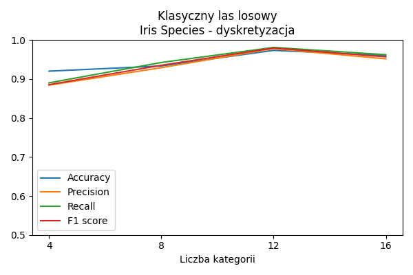

##### Liczba klasyfikatorów w lesie losowym

```python
    n_classifiers = [100, 125, 150, 200, 225, 250, 275, 300]
```


##### Współczynnik ilości cech

```python
    p_features = [0.5, 0.75, 1.0, 1.25, 1.5, 1.75, 2.0]
```

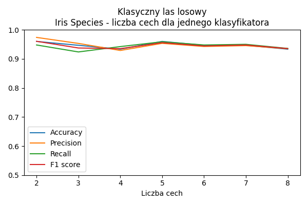

##### Współczynnik ilości próbek do trenowania

```python
    p_samples = [0.5, 0.75, 1.0, 1.25, 1.5, 1.75, 2.0]
```


##### Wnioski

Jakość predykcji nie zalezy od testowanych przez nas parametrów i jest bardzo wysoka (ponad 90%)

#### Breast Cancer Wisconsin

##### Liczba kategorii na które dyskretyzowane są cechy

```python
    n_bins = [4, 8, 12, 16]
```

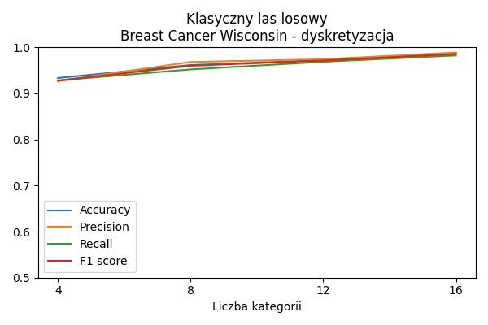

##### Liczba klasyfikatorów w lesie losowym

```python
    n_classifiers = [100, 125, 150, 200, 225, 250, 275, 300]
```


##### Współczynnik ilości cech

```python
    p_features = [0.25, 0.5, 0.75, 1.0, 1.25]
```


##### Współczynnik ilości próbek do trenowania

```python
    p_samples = [0.5, 0.75, 1.0, 1.25, 1.5, 1.75, 2.0]
```


#### Wnioski

Wyniki dla zbioru **Breast Cancer Wisconsin** są podobne, jak dla innych zbiorów i algorytmów.

### **Porównanie algorytmów**

Na koniec porównaliśmy wszystkie trzy algorytmy, uruchamiając je z najlepszymi, według nas, parametrami.

#### Diabetes Dataset

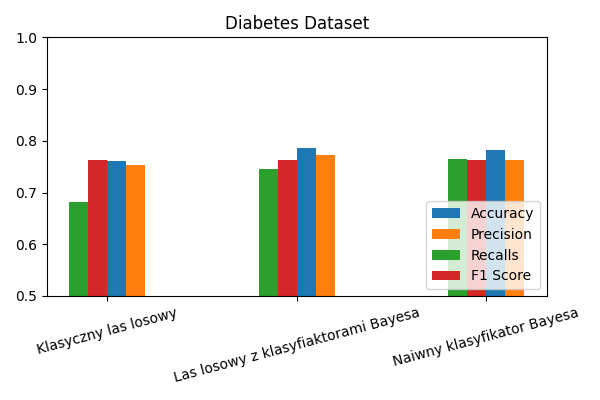

#### Iris Species

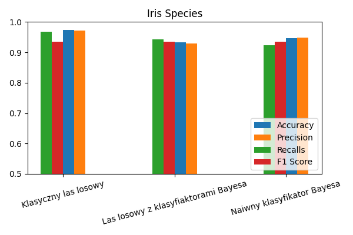

#### Breast Cancer Wisconsin

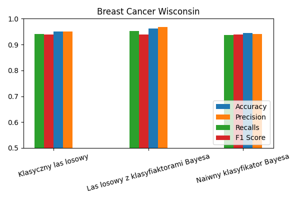

## **5. Wnioski**

Z naszych badań wynika, że wszystkie 3 rodzaje klasyfikatorów, naiwny klasyfikator Bayesa, las losowy oraz las losowy z klasyfikatorami Bayesa osiągają podobne wyniki na testowanych przez nas zbiorach danych. Parametry, które zmienialiśmy miały niewielki wpływ na skuteczność klasyfikacji.

Mimo to, wyniki były wysokie, skuteczność powyżej 90% w przypadku Breast Cancer Wisconsin i Iris Species. Może to wynikać z faktu, że zbiory są stosunkowo proste, a dane równomiernie rozłożone, co zbliża założenie o niezależności danych, w klasyfikatorze Bayesa, do prawdy.

Możliwe, że przeprowadzenie testów na bardziej skomplikowanych zbiorach ujawniłoby różnice w jakości klasyfikatorów.

Las losowy złożony z naiwnych klasyfikatorów Bayesa, może też dawać nie lepsze wyniki, niż pojedynczy klasyfikator, ponieważ zyski osiągnięte dzięki lepszym klasyfikatorom, były niwelowane, przez gorsze, które otrzymały niekorzystny zestaw danych.

## 6. **Podsumowanie**

W archiwum zip razem ze sprawozdaniem znajduje się kod źródłowy oraz wyniki testów ułożonych w strukturze katalogów, na podstawie parametrów, z którymi test był uruchomiony. Implementacja klasyfikatorów, opisana na początku dokumentacji, znajduje sie w katalogu `src/classifiers`. W pliku `plots.py` znajdują sie tylko funkcje wyciągające odpowiednie testy ze struktury katalogów i tworzące wykresy na ich podstawie.

Do implementacji projektu użyliśmy bibliotek pandas, scikit-learn. Zbiory danych pochodziły ze strony kaggle.com.

Każdy test przeprowadzany w ramach projektu, to średnia minimum 5 uruchomień.
